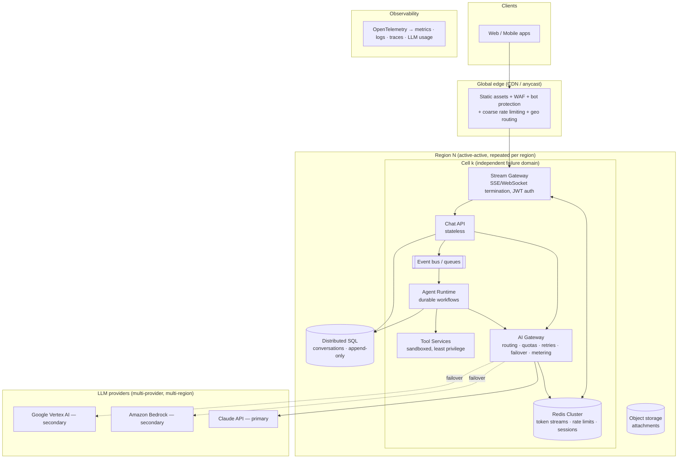

# Architecture: High-Demand AI Chat & Agent Platform

| | |
|---|---|
| **Status** | Draft v0.2 — for review |
| **Date** | 2026-09-26 |
| **Scope** | Cloud-agnostic platform serving a streaming chat assistant and tool-using AI agents |
| **Current load** | **6,000–10,000 per day** (≈0.1 req/s average) — see §0 |
| **Growth target** | 1M+ concurrent users, spiky, global (§1 onward) |
| **Stack** | Python 3.12, FastAPI, Anthropic Python SDK; light model (Claude Haiku 4.5) for first versions |

---

## 0. Current phase: right-sized v1

The real traffic is **6,000–10,000 per day**, not 1M concurrent. Even at 10× peaks, that's under ~2 requests/second. The hyperscale design in §1–§10 stays as the **growth path**. v1 builds only what this load needs and keeps the same seams, so later growth is additive rather than a rewrite.

| Concern | v1 (now) | Grow into (when needed) |
|---|---|---|
| Deployment | One modular Python service (FastAPI), 2 replicas behind a load balancer, one region | Split services, cells, multi-region (ADR-0001) |
| Streaming | SSE directly from the API process | Decoupled Redis Streams + stream gateway (ADR-0002) |
| AI Gateway | In-process module: retries, circuit breaker, sticky provider failover, cache breakpoints, usage logs | Separate service with shared quotas (ADR-0003) |
| Model | **Claude Haiku 4.5** on every route (configured in `llm/models.py`) | Per-route upgrades (Sonnet 5 / Opus 5) driven by evals |
| Agents | In-process tool loop with iteration cap, validation, approval gate | Durable workflows (Temporal) (ADR-0004) |
| Storage | **Postgres** (SQLAlchemy + Alembic): conversations, append-only messages keyed by `(conversation_id, seq)`, usage events. In-memory for local dev only | Distributed SQL |
| Limits | Per-user rate limit (per replica) + daily token quota (shared via `usage_events` in Postgres) | Redis-backed, degradation ladder (ADR-0005) |
| Auth | **OIDC access tokens** (JWT, verified against the issuer's JWKS; any standard provider, Auth0 recommended). Dev-only header mode, refused in production | Same, plus roles/scopes per tool |
| UI | **Web chat UI** served by the API (plain JS, strict CSP): streaming chat, conversation list, agent tool calls, approval cards, OIDC login with PKCE | Separate frontend app/CDN if it grows |
| Hosting | Any container platform (Cloud Run, ECS/Fargate, Azure Container Apps, or a small K8s) | Kubernetes + GitOps |

**Rough v1 cost on Haiku 4.5 ($1 / $5 per MTok):** at about $0.006 per request with the §2 token assumptions, 10,000 requests/day is about **$60/day** in model cost. If "10,000 per day" means users sending ~10 messages each, it's about $600/day. Agent runs take several model calls each, so they cost a multiple of that. Infrastructure is small by comparison.

**Upgrade triggers:** move to the next column of a row when its signal appears. Examples: sustained >50 req/s, a second region needed for latency or residency, agent tasks running longer than one HTTP request, or eval scores showing Haiku isn't good enough for a route.

---

## 1. Requirements

### Functional
- **Chat assistant**: real-time, token-by-token streamed responses; multi-turn conversations persisted and resumable across devices.
- **Agents with tools**: multi-step tasks where the model calls our tools/APIs (search, CRUD on business data, integrations), with human approval for irreversible actions.
- Conversation history, per-user/tenant quotas, admin/usage reporting.

### Non-functional
| Attribute | Target (proposed — confirm) |
|---|---|
| Concurrent connected users | 1M sustained, 3× burst within minutes |
| Availability | 99.95% for chat; region loss must not take the product down |
| Time-to-first-token (TTFT) p95 | < 1.5 s (excluding model thinking time) |
| Platform overhead p99 (everything except the model) | < 150 ms |
| Recovery | RPO ≤ 1 min for conversation data, RTO ≤ 5 min for regional failover |
| Portability | No hard dependency on a single cloud; Kubernetes + open-source building blocks |

---

## 2. The constraints that actually drive this design

At this scale the web tier is the *easy* part. Three things dominate:

1. **LLM capacity (tokens/minute) is the real bottleneck.** Providers enforce rate limits per org/model/region. You cannot autoscale your way past them — you need contracted capacity, multiple providers, and admission control.
2. **LLM cost dwarfs infrastructure cost.** Every design choice that improves prompt-cache hit rate or trims tokens is worth more than any compute optimization.
3. **Long-lived connections + slow responses.** A chat reply streams for 5–60 s; an agent task can run minutes. Pods die, deploys happen, networks flap — streams must survive that.

### Back-of-envelope sizing (replace assumptions with real numbers)

| Assumption | Value |
|---|---|
| Concurrent users | 1,000,000 |
| Avg. messages per active user | 1 every 2 min |
| → Average request rate | **~8,300 LLM requests/s** (peak ~25,000/s at 3× burst) |
| Input tokens per request (system + tools + history) | ~20,000, ~90% served from prompt cache |
| Output tokens per request | ~400 |
| → Input token throughput | **~166M tokens/s** (~10B/min) |
| → Output token throughput | **~3.3M tokens/s** |

Rough cost per request = `input × (0.9 × cache_read_price + 0.1 × cache_write_price) + output × output_price`:

| Model (list price, 1P API) | ≈ $/request | ≈ $/day at 8.3k req/s |
|---|---|---|
| Claude Opus 5 ($5 / $25 per MTok) | ~$0.03 | ~$22M |
| Claude Sonnet 5 ($2 / $10) | ~$0.013 | ~$9M |
| Claude Haiku 4.5 ($1 / $5) | ~$0.006 | ~$4.5M |

These numbers are illustrative, but the order of magnitude is the point. **Before building, validate the traffic model and secure provider capacity commitments.** The architecture below assumes that per-request token efficiency, caching, quotas, and graceful degradation are first-class features, not afterthoughts.

Connection tier: 1M concurrent SSE connections at ~50k connections per tuned gateway pod ≈ 20 pods minimum, deployed ~2× over across regions for headroom.

---

## 3. High-level architecture

### Request flow — chat turn
1. Client opens `POST /conversations/{id}/messages` and receives a `message_id`; it then subscribes to `GET /streams/{message_id}` (SSE).
2. **Stream Gateway** validates the JWT locally (no auth round-trip), applies per-user token-bucket limits (Redis), and forwards to the **Chat API**.
3. **Chat API** appends the user message to the conversation log, builds the prompt (cache-friendly order — §5.3), and calls the **AI Gateway**.
4. **AI Gateway** checks tenant token quota, picks provider/region/model, and streams from the provider. Each chunk is written to a **Redis Stream** keyed by `message_id`.
5. The Stream Gateway tails that Redis Stream and pushes SSE events to the client. On reconnect, the client sends `Last-Event-ID` and resumes without loss (ADR-0002).
6. On completion, the final assistant message (full content blocks, not just text) and token usage are persisted; usage events go to the metering pipeline.

### Request flow — agent task
1. Chat API detects an agent-type request (or the user invokes one) and enqueues a durable workflow.
2. **Agent Runtime** runs the tool loop: call model → execute requested tools (in parallel when safe) → return all results in one message → repeat until `end_turn`, budget exhausted, or approval needed.
3. Each step is checkpointed. If a worker dies, the workflow resumes from the last completed step on another worker (ADR-0004).
4. Progress (tool calls, partial text) streams to the user through the same Redis Stream → SSE path.
5. Irreversible tools (send email, payments, deletes) pause the workflow for user approval.

---

## 4. Components

### 4.1 Global edge
- Cloud-agnostic CDN/edge provider (e.g. Cloudflare, Fastly, Akamai): TLS, WAF, DDoS, bot management, geo-steering to the nearest healthy region.
- Coarse rate limits at the edge (per IP / per token) protect origin during abuse spikes.
- Static frontend served entirely from the edge.

### 4.2 Regions and cells (ADR-0001)
- **Multi-region active-active** (start with 3: Americas, Europe, Asia-Pacific).
- Each region contains multiple **cells** — self-contained copies of the stack sized for a fixed maximum (e.g. 100k concurrent users). Users/tenants are pinned to a home cell by consistent hashing.
- A bad deploy or noisy tenant affects one cell, not the world. Scaling = add cells, not grow a single giant cluster.
- Deploys roll out cell by cell with automatic halt on SLO regression.

### 4.3 Stream Gateway
- Dedicated tier for long-lived SSE (preferred; plain HTTP, proxy/CDN friendly) and WebSocket (only if bidirectional real-time is needed).
- Tuned for connection count: high file-descriptor limits, small per-connection memory, HTTP/2, heartbeat every 15 s.
- **Holds no generation state** — it only relays from Redis Streams. Killing a gateway pod just forces clients to reconnect and resume.
- Graceful drain on deploy: stop accepting, send `retry` hint, close after in-flight streams move.

### 4.4 Chat API (stateless)
- Conversation CRUD, prompt assembly, quota pre-checks, idempotency (`Idempotency-Key` header on message creation to prevent double-sends on retry).
- Horizontal autoscaling on CPU + in-flight requests.

### 4.5 AI Gateway (ADR-0003) — the core of the AI layer
A single internal service that **every** model call goes through. Responsibilities:

| Concern | Design |
|---|---|
| **Provider adapters** | Official Anthropic SDK clients: first-party client, `AnthropicBedrockMantle`, `AnthropicVertex`. Same Messages API surface across all three. |
| **Routing** | Per *route* config (chat, agent-planner, agent-worker, summarizer…) → model + effort + provider priority list. |
| **Stickiness** | A conversation stays on the same provider+region+model while healthy — prompt caches are scoped per provider and per model, so switching costs a full cache rewrite. |
| **Rate limiting** | Token-aware (not just request-count) limits per tenant/user, enforced in Redis; global concurrency limits per provider/region sized to contracted capacity. |
| **Retries** | Retry 429 / 5xx / 529 / connection errors with exponential backoff + full jitter, honoring `retry-after`. Never retry 400/401/403/404. Retry budget capped (≤10% extra load) to avoid retry storms. |
| **Circuit breakers** | Per provider-region: open on sustained error/latency; half-open probes; route traffic to the next provider in the list. |
| **Failover** | Primary: Claude API. Secondary: Bedrock, Vertex. Only use the **portable feature subset** on failover-eligible routes (§5.4). |
| **Refusals** | Always check `stop_reason` before reading content. Handle `refusal`; on the Claude API use server-side `fallbacks`, on Bedrock/Vertex the SDK's client-side refusal fallback middleware. |
| **Metering** | Record `usage` (input, output, cache read, cache write tokens) per request → event bus → billing, quotas, dashboards. |
| **Load shedding** | Priority classes (paid > free, interactive > background); executes the degradation ladder (§6.2). |
| **Safety & policy** | Input/output moderation hooks, PII redaction before logging, tenant-level model allow-lists. |

### 4.6 Agent Runtime (ADR-0004)
- **Durable workflow engine** (e.g. Temporal — self-hosted or cloud, portable) runs each agent task as a workflow; each model call and tool call is an activity with timeout, retry policy, and idempotency key.
- Tool loop rules:
  - Execute parallel `tool_use` blocks concurrently; return **all** `tool_result` blocks in a single message; failures returned as `is_error: true`, never dropped.
  - Validate every tool input against its schema before execution; use `strict: true` tool definitions.
  - Hard limits per task: max iterations, max wall-clock, max tokens (our own accounting on every provider; Claude API task budgets where available).
  - Treat tool results as **untrusted data** (prompt-injection defense): tools run with the end user's permissions, never with elevated service credentials.
- **Tool Services** are separate deployments with least-privilege credentials, per-tool timeouts and rate limits, and an approval gate for irreversible actions.
- Long agent conversations use compaction/context editing (beta) or our own summarization when approaching context limits.

### 4.7 Data layer
| Store | Purpose | Portable options |
|---|---|---|
| **Distributed SQL** | Users, tenants, conversations, messages (append-only), agent task state, audit log | CockroachDB, YugabyteDB (or regional Postgres + logical replication for a simpler start) |
| **Redis Cluster** (per cell) | Token streams (Redis Streams, TTL ~10 min), rate-limit buckets, session cache | Redis / Valkey / Dragonfly |
| **Event bus** | Usage metering, analytics, async jobs, cross-service events | Kafka / Redpanda / NATS JetStream |
| **Object storage** | Attachments, exports, conversation archives | S3-compatible (any cloud, MinIO) |
| **Vector store** (later) | Long-term memory / retrieval | pgvector, Qdrant |

- Conversations partitioned by `tenant_id` / `conversation_id`, homed in the user's region (data residency).
- **Messages are append-only.** Never edit earlier turns — this keeps prompt caches valid and is required by newer Claude models, which reject edited history that carries thinking blocks.

### 4.8 Platform & operations
- **Kubernetes** in every region (EKS/GKE/AKS/bare metal — interchangeable), provisioned with **Terraform/OpenTofu**, deployed with **GitOps (Argo CD)**.
- Autoscaling: HPA on CPU/in-flight requests; **KEDA** on queue depth for agent workers; cluster autoscaler / Karpenter for nodes; **scheduled pre-scaling** before known peaks.
- Service mesh optional (Linkerd/Istio) for mTLS and retries between services — avoid double retries (mesh + AI Gateway).
- Secrets: Vault / External Secrets Operator. Provider credentials never leave the AI Gateway.

---

## 5. AI layer design details

### 5.1 Model selection
Default recommendation is **Claude Opus 5** with per-route effort tuning (e.g. `low` for simple chat, `high`/`xhigh` for agent planning). With adaptive thinking, lower effort on a top model often matches older models at high effort, and one model means one cache namespace.

Model choice per route is a **business decision** driven by the cost table in §2 — see Open Decisions. Candidate split to evaluate with a real eval set:

| Route | Candidate | Why |
|---|---|---|
| Chat (default) | Opus 5 @ `low`/`medium`, or Sonnet 5 | Quality vs. cost at huge volume |
| Agent planner / orchestrator | Opus 5 @ `high` | Multi-step reasoning, fewer wasted tool calls |
| Agent sub-tasks (reading, extraction) | Haiku 4.5 or Sonnet 5 | Cheap, fast, parallelizable |
| Background (summaries, titles, classification) | Haiku 4.5 via Batches API (50% cheaper, 1P only) | Not latency-sensitive |

Rule: do **not** switch models mid-conversation (it breaks the cache); spawn a sub-agent on a cheaper model instead.

### 5.2 Streaming
- Always stream from the provider for chat and agent calls (avoids HTTP timeouts on long outputs, enables TTFT < 1.5 s).
- Stream tool-input JSON eagerly where supported, and validate the final parsed input before running the tool.
- Show thinking/progress to users only if desired (`display: "summarized"`); otherwise show a "thinking…" indicator — the default display omits thinking text, which looks like a pause.

### 5.3 Prompt caching (biggest cost lever)
- Prompt order: **tools (sorted, deterministic) → system prompt (frozen) → conversation history → new user message**.
- Nothing volatile in the system prompt (no timestamps, user IDs, request IDs). Per-turn/per-user context goes into messages, or as mid-conversation system messages on models that support them.
- One explicit cache breakpoint at the end of the static system prefix + automatic caching for the growing conversation tail.
- Keep the tool set fixed per route; "modes" are expressed in messages, not by swapping tools.
- Sticky provider/model per conversation (§4.5).
- Monitor `cache_read_input_tokens`; alert if the hit ratio drops (silent invalidators).

### 5.4 Multi-provider portability
Features used on **failover-eligible routes** must work on the Claude API, Bedrock and Vertex:

✅ Messages + streaming + tool use · structured outputs / strict tools · adaptive thinking + effort · prompt caching · token counting · citations · compaction/context editing (beta)

⚠️ Claude API / Claude Platform on AWS only — use on non-failover routes or with a degraded fallback: Message Batches, Files API, server-side `fallbacks`, task budgets, MCP connector, code execution, web fetch, Managed Agents, `inference_geo`. (Web search: not on Bedrock.)

Failover costs: a cold cache on the secondary provider means one full-price prompt write per conversation — plan budget and capacity for it.

### 5.5 Token budgeting and quotas
- Per tenant/user: daily and per-minute token quotas enforced in the AI Gateway (pre-check with estimated tokens, reconcile with actual `usage`).
- Per request: sensible `max_tokens` per route; hard iteration/token caps per agent task.
- Context growth: compaction or summarization once a conversation passes a threshold.

---

## 6. Resilience

### 6.1 Failure modes
| Failure | Mitigation |
|---|---|
| Provider 429 / overload | Backoff + jitter, provider circuit breaker, failover to secondary, degradation ladder |
| Provider regional outage | Route to another region of the same provider, then another provider |
| Our region down | Edge steers users to the next region; conversations readable from replicas; active streams reconnect and regenerate |
| Pod death mid-stream | Gateway: client resumes via `Last-Event-ID`. Generator: AI Gateway restarts generation, stream marks a restart |
| Agent worker death | Durable workflow resumes from last checkpoint |
| Retry storm | Retry budgets, jitter, client-side backoff on `retry` hints |
| Bad deploy | Cell-by-cell rollout, automated SLO-based rollback |
| Prompt injection via tool results | Least-privilege tools, approval gates, results treated as data |

### 6.2 Degradation ladder (ADR-0005)
Applied automatically when provider capacity or budget is under pressure, lowest-priority traffic first:
1. Lower `effort` on chat routes.
2. Pause background/batch work.
3. Route free tier to a cheaper model (new conversations only, to preserve caches).
4. Queue new requests with an honest "high demand — you're in line" UI.
5. Reject new sessions for lowest-priority traffic; existing conversations keep working.

---

## 7. Observability
- **OpenTelemetry** everywhere → metrics (Prometheus/Mimir), logs (Loki), traces (Tempo), dashboards (Grafana). All open source and portable.
- **AI-specific SLIs**: TTFT, output tokens/s, cache hit ratio, cost per conversation and per agent task, 429/5xx rate per provider-region, refusal rate, tool error rate, agent iterations per task.
- Every model call traced with route, provider, model, effort, token usage and conversation ID (content logged only with redaction and per-tenant consent).
- SLO burn-rate alerts; weekly cost review per route.

---

## 8. Security & compliance
- OIDC authentication; short-lived JWTs verified at the gateway; per-tenant isolation in every store.
- mTLS between services; network policies deny by default.
- Provider keys only in the AI Gateway; tools get scoped, per-user credentials.
- Data residency: conversations homed in the user's region; choose provider regions to match.
- Audit log of every agent tool execution and approval.
- Abuse prevention: edge bot protection, quotas, moderation hooks.

---

## 9. Rollout plan
| Phase | Scope | Exit criteria |
|---|---|---|
| **0 — Foundations** | IaC, one region, one cell, CI/CD, observability | Deploys are automated and observable |
| **1 — Chat MVP** | Stream Gateway, Chat API, AI Gateway (Claude API only), conversations | p95 TTFT met at 10k concurrent in load test |
| **2 — Agents** | Agent Runtime, 3–5 tools, approval flow | Agent eval set passes quality bar |
| **3 — Scale out** | Multi-cell, 3 regions, Bedrock/Vertex failover, degradation ladder | Game-day: kill a region and a provider without user-visible outage |
| **4 — Hyperscale** | Load test to 1M concurrent + 3× burst, cost tuning | SLOs and cost per conversation within target |

Load testing: k6 or Locust with an **LLM mock** that emits realistic streaming latency — testing against real providers at this scale is prohibitively expensive and rate-limited.

---

## 10. Open decisions
1. ~~Implementation language~~ — **decided: Python** (FastAPI + Anthropic Python SDK).
2. **Model per route** — v1 uses Claude Haiku 4.5 everywhere; build an eval set before upgrading any route.
3. **Traffic model** — 6,000–10,000 per day (confirm: requests or users?), plus prompt size and agent vs. chat share.
4. **Provider capacity**: contracted throughput with Anthropic and the secondary providers.
5. **Compliance**: data residency regions, retention, zero-data-retention needs (some models require 30-day retention).
6. **Initial tool inventory** for agents and which tools are irreversible (need approval).
7. **Managed vs. self-hosted**: Temporal Cloud vs. self-hosted, managed Redis/Kafka per cloud vs. self-run.

## Architecture Decision Records
- [ADR-0001 — Cell-based, multi-region active-active](../adr/0001-cell-based-multi-region.md)
- [ADR-0002 — Decoupled token streaming over SSE](../adr/0002-decoupled-token-streaming.md)
- [ADR-0003 — Central AI Gateway with multi-provider failover](../adr/0003-ai-gateway.md)
- [ADR-0004 — Durable agent runtime with append-only history](../adr/0004-durable-agent-runtime.md)
- [ADR-0005 — Admission control and degradation ladder](../adr/0005-degradation-ladder.md)
